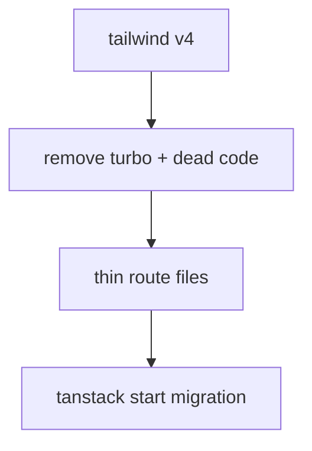

# migration prep plan

## goals

- reduce next-specific coupling before the tanstack start move
- remove tooling that makes the bundler swap noisier than it needs to be
- keep route content and metadata importable as normal modules



## verified findings

### tanstack route files can export more than `Route`

**confidence:** verified  
**evidence:** a temp tanstack start app at `/Users/bdsqqq/commonplace/02_temp/ts-start-export-probe` built successfully with both `export const meta = ...` and `export const Route = createFileRoute(...)` in `src/routes/index.tsx`. `pnpm build` and `pnpm exec tsc --noEmit` both passed.  
**why this matters:** we do not need next-style sidecar metadata files just because a file is a route.

### colocated non-route files are a first-class tanstack pattern

**confidence:** verified  
**evidence:** tanstack router docs support `-`-prefixed files and folders to exclude them from route generation while keeping them colocated next to routes.  
**why this matters:** we can use either extra exports in route files or nearby `-meta.ts` / `-content.tsx` modules where that shape feels cleaner.

### tailwind v4 should happen before the framework migration

**confidence:** verified  
**evidence:** current repo still uses `tailwindcss@3`, `postcss`, `autoprefixer`, and `postcss.config.js`. next 16 still needs a minimal postcss bridge for tailwind v4 via `@tailwindcss/postcss`, but the legacy nesting + autoprefixer stack can go away.  
**why this matters:** shrinking postcss to the minimal v4 bridge reduces cross-tool churn during the tanstack move without breaking next.

### turbo is removable now

**confidence:** verified  
**evidence:** no `package.json` scripts call `turbo`; root scripts are `next`, `oxlint`, and `oxfmt`. remaining turbo surface is `package.json`, `turbo.json`, `.gitignore`, lockfile, and generated cache dirs.  
**why this matters:** it is dead migration ballast unless we intentionally become a turborepo.

### next coupling is real, but mostly concentrated

**confidence:** verified  
**evidence:** next-specific surfaces are concentrated in `app/layout.tsx`, `app/error.tsx`, `app/api/og/route.tsx`, `lib/makeSeo.ts`, many route files using `Metadata`, `components/MainNav.tsx` / `components/ui/primitives/UnstyledLink.tsx` (`next/link`), `app/Providers.tsx` (`next/navigation`), and image/font/script usage.  
**why this matters:** we can clean structure first, then swap framework APIs in one focused pass.

## order of operations

### 1. ~~migrate to tailwind v4~~ ✅

**done**
- replaced tailwind v3 + legacy postcss/autoprefixer with tailwind v4 + minimal `@tailwindcss/postcss`
- moved theme from `tailwind.config.js` to CSS `@theme` block in `globals.css`
- replaced `tailwindcss-animate` with `tw-animate-css`
- replaced `tailwindcss-radix` plugin with arbitrary value `origin-(--radix-popover-content-transform-origin)`
- removed `autoprefixer`
- safelist no longer needed — v4 generated the dynamic grid-cols-N utilities used by `subGrid()` in build output
- `--color-*` vars now generated by `@theme` instead of custom plugin

### 2. ~~remove dead tooling and dead code~~ ✅

**done**
- removed `turbo` package + `turbo.json` + `.gitignore` turbo entries
- deleted empty `app/library/button/meta.ts` and `app/library/portals/meta.ts`
- removed unused default export from `app/play/game-of-life/client.tsx`
- unexported `PRETEND_NAVBAR_PORTAL_NAME` (only used within `showcase.tsx`)
- deleted `tailwind.config.js` (superseded by CSS `@theme`)

**kept**
- `nanoid` kept as requested

### 3. thin route files

**do before framework migration**
- move content, metadata, and view logic out of heavy route files into plain colocated modules
- keep route files as framework glue: route config, loader hooks, and small composition only
- move list/index data out of fake route-adjacent registries when a route can own its own metadata directly

**template slice: `library/portals`** ✅
- `page.tsx` — framework glue + fs read only
- `view.tsx` — page composition component, receives data as props
- `content.tsx` — static MDX prose, plain module
- `showcase.tsx` — client interactive demos (unchanged)

**target shape**

```text
app-or-routes/
  writing/my-post/
    page.tsx or route.tsx
    meta.ts
    view.tsx
    content.tsx
```

or, where it stays small:

```ts
export const meta = { ... }
export const Route = createFileRoute(...)({ ... })
```

**why this helps**
- content becomes importable without framework rules getting in the way
- migration becomes mostly file-moving and api-swapping, not archaeology

### 4. migrate to tanstack start

**do after cleanup**
- convert route structure
- replace `next/link`, `next/navigation`, `Metadata`, `next/image`, `next/font`, `next/script`
- port redirects from `next.config.mjs`
- port og route to a tanstack server route using `@vercel/og`

## repo-specific notes

### og image generation is not a blocker

**confidence:** verified  
**evidence:** current og route already uses `@vercel/og` in `app/api/og/route.tsx`; tanstack server routes return standard `Response` objects; `@vercel/og` works outside next.  
**why this matters:** we can carry the og logic over with minimal conceptual change.

### some current patterns are worth deleting, not migrating

**confidence:** verified  
**evidence:** empty `meta.ts` files, dead helpers, and unused exports do not encode meaningful architecture.  
**why this matters:** we should not cargo-cult dead shapes into the new app.

## practical execution buckets

### bucket a — tailwind v4
- package updates
- config removal/rewrite
- class/plugin fixes
- visual smoke test

### bucket b — tooling cleanup
- remove turbo
- remove stale files
- rerun knip / install

### bucket c — route shaping
- pick a small slice first: `work`, `writing`, or `library`
- establish one durable metadata/content pattern
- propagate only after it feels good

### bucket d — framework migration
- scaffold tanstack start
- move one slice at a time
- keep the app runnable throughout

## open questions

- do we want route metadata as extra exports in the route file, or colocated `meta.ts` files by convention?
- which route slice should become the template for the rest: `work`, `writing`, or `library`?
- do we want to keep any radix primitives during migration, or start shrinking that surface first?
