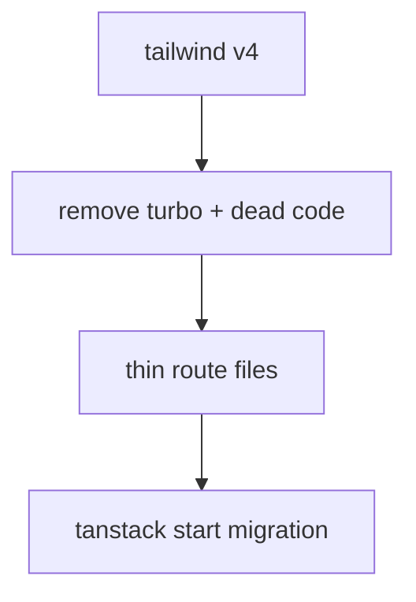

# migration prep plan

## goals

- reduce next-specific coupling before the tanstack start move
- remove tooling that makes the bundler swap noisier than it needs to be
- keep route content and metadata importable as normal modules



## verified findings

### tanstack route files can export more than `Route`

**confidence:** verified  
**evidence:** a temp tanstack start app at `/Users/bdsqqq/commonplace/02_temp/ts-start-export-probe` built successfully with both `export const meta = ...` and `export const Route = createFileRoute(...)` in `src/routes/index.tsx`. `pnpm build` and `pnpm exec tsc --noEmit` both passed.  
**why this matters:** we do not need next-style sidecar metadata files just because a file is a route.

### colocated non-route files are a first-class tanstack pattern

**confidence:** verified  
**evidence:** tanstack router docs support `-`-prefixed files and folders to exclude them from route generation while keeping them colocated next to routes.  
**why this matters:** we can use either extra exports in route files or nearby `-meta.ts` / `-content.tsx` modules where that shape feels cleaner.

### tailwind v4 should happen before the framework migration

**confidence:** verified  
**evidence:** current repo still uses `tailwindcss@3`, `postcss`, `autoprefixer`, and `postcss.config.js`. next 16 still needs a minimal postcss bridge for tailwind v4 via `@tailwindcss/postcss`, but the legacy nesting + autoprefixer stack can go away.  
**why this matters:** shrinking postcss to the minimal v4 bridge reduces cross-tool churn during the tanstack move without breaking next.

### turbo is removable now

**confidence:** verified  
**evidence:** no `package.json` scripts call `turbo`; root scripts are `next`, `oxlint`, and `oxfmt`. remaining turbo surface is `package.json`, `turbo.json`, `.gitignore`, lockfile, and generated cache dirs.  
**why this matters:** it is dead migration ballast unless we intentionally become a turborepo.

### next coupling is real, but mostly concentrated

**confidence:** verified  
**evidence:** next-specific surfaces are concentrated in `app/layout.tsx`, `app/error.tsx`, `app/api/og/route.tsx`, `lib/makeSeo.ts`, many route files using `Metadata`, `components/MainNav.tsx` / `components/ui/primitives/UnstyledLink.tsx` (`next/link`), `app/Providers.tsx` (`next/navigation`), and image/font/script usage.  
**why this matters:** we can clean structure first, then swap framework APIs in one focused pass.

## order of operations

### 1. ~~migrate to tailwind v4~~ ✅

**done**
- replaced tailwind v3 + legacy postcss/autoprefixer with tailwind v4 + minimal `@tailwindcss/postcss`
- moved theme from `tailwind.config.js` to CSS `@theme` block in `globals.css`
- replaced `tailwindcss-animate` with `tw-animate-css`
- replaced `tailwindcss-radix` plugin with arbitrary value `origin-(--radix-popover-content-transform-origin)`
- removed `autoprefixer`
- safelist no longer needed — v4 generated the dynamic grid-cols-N utilities used by `subGrid()` in build output
- `--color-*` vars now generated by `@theme` instead of custom plugin

### 2. ~~remove dead tooling and dead code~~ ✅

**done**
- removed `turbo` package + `turbo.json` + `.gitignore` turbo entries
- deleted empty `app/library/button/meta.ts` and `app/library/portals/meta.ts`
- removed unused default export from `app/play/game-of-life/client.tsx`
- unexported `PRETEND_NAVBAR_PORTAL_NAME` (only used within `showcase.tsx`)
- deleted `tailwind.config.js` (superseded by CSS `@theme`)

**kept**
- `nanoid` kept as requested

### 3. thin route files

**do before framework migration**
- move list/index data out of fake route-adjacent registries when a route can own its own metadata directly
- do NOT create new `view.tsx`/`content.tsx` sidecars as prep — the tanstack start target is same-file route ownership where each route file owns its content and route-local meta
- next's `page.tsx` / `Metadata` API is why some metadata still lives in external files today; that constraint disappears with the framework swap
- established in `app/writing/not-just-the-basics/page.tsx`: the route can own its listing + seo source object, while `app/writing/metas.ts` becomes a minimal re-export for existing list consumers
- next 16 in this repo accepts extra named exports from `page.tsx` beyond `metadata`/`generateMetadata`; verified via `.next/types/validator.ts` assigning page modules to `AppPageConfig`, and `pnpm exec tsc --noEmit` passed after adding a route-local meta export
- propagated to `on-writing/page.tsx` and `dont-believe-in-yourself/page.tsx`; `metas.ts` now re-exports `onWritingMeta`, `basicsMeta`, `dontBelieveMeta` from their routes; `tsc --noEmit` passes
- propagated to `schrodinger-minimalism/page.tsx` and `macos-rice/page.tsx`; `metas.ts` is now a pure re-export surface with zero central meta objects; `tsc --noEmit` passes
- propagated to `app/work/{bebop,iss,wasmgif,ibm,the-manual}/page.tsx`; `app/work/metas.ts` now re-exports route-local metas and only keeps `minesweeperMeta` inline because no route exists yet; `tsc --noEmit` passes

**target shape (tanstack start)**

```ts
// routes/writing/my-post/route.tsx
export const meta = { ... }
export const Route = createFileRoute(...)({
  component: MyPost,
})
function MyPost() { /* content lives here */ }
```

colocated `-meta.ts` or `-content.tsx` sidecars are fine where a route is genuinely large, but same-file ownership is the default.

**why this helps**
- fewer files to move during migration
- route ownership is explicit — no indirection through sidecars for the common case
- content remains importable via colocated `-`-prefixed modules where needed

### 4. migrate to tanstack start

**start is now primary runtime**
- ✅ home route (`src/routes/index.tsx`) owns the home page content directly; deleted the old `app/page.tsx` copy
- ✅ work index route (`src/routes/work.tsx`) reuses `app/work/page.tsx` for real `/work` content
- ✅ shared link primitives and breadcrumb pathname tracking no longer import `next/link` or `next/navigation`; the Start build no longer needs compat aliases for either
- ✅ `/writing/grow`, `/writing/dont-believe-in-yourself`, `/writing/not-just-the-basics`, `/writing/on-writing`, `/writing/schrodinger-minimalism`, `/writing/macos-rice`, `/writing/scales` — route content + route-local meta now live in `src/routes/writing/*`; Start routes are the source of truth
- ✅ `MDX` component switched from async `compile`+`run` to sync `evaluateSync` — works in both runtimes
- ✅ `/play` index + all 8 subroutes (`actions`, `bouncy-tooltip`, `game-of-life`, `pokemon`, `synced-positions`, `og-preview`, `style-composition`, `style-overhaul`) — reuse `app/play/*/page.tsx` directly
- ✅ `/work/bebop`, `/work/iss`, `/work/wasmgif`, `/work/ibm`, `/work/the-manual`, `/work/ibm/Think-2022` — reuse `app/work/*/page.tsx` directly (removed unnecessary `async` from default exports; `tsc -p tsconfig.start.json` clean)
- ✅ `/library/button`, `/library/portals` — `createServerFn` reads source at load time; extracted `content.tsx` components reused from `app/library/*/content.tsx`
- ✅ `/library` index route — minimal listing page linking to button and portals; fixes the `backAnchor="library"` fallback for current library routes
- ✅ `/p/$slug` redirect route — Start `beforeLoad` redirects to `/work/$slug` with a 301
- ✅ `/api/og` server route — Start route serves `@vercel/og` image responses with the existing logic
- ✅ replaced `next/image` — local `components/ui/Image.tsx` wrapper used everywhere; vite shim removed
- ✅ `next/font` and `next/script` — replaced by the TanStack Start root shell; deleted `app/layout.tsx` after moving document/head responsibility to `src/routes/__root.tsx`
- ✅ `dev`/`build`/`start` now target TanStack Start; removed the legacy Next.js scripts from `package.json`
- ✅ removed `src/shims/next-link.tsx` and `src/shims/next-navigation.ts` — no shared code imports them

**next.js removal: complete**
- `next` and `postcss` removed from `package.json`
- empty `app/writing/` and `app/api/` directories deleted
- remaining `app/` files are plain React components imported by Start routes — no Next.js API surface
- `__root.tsx` handles fonts and analytics; Start route at `src/routes/api/og.tsx` handles OG images

## repo-specific notes

### og image generation is not a blocker

**confidence:** verified  
**evidence:** current og route already uses `@vercel/og` in `app/api/og/route.tsx`; tanstack server routes return standard `Response` objects; `@vercel/og` works outside next.  
**why this matters:** we can carry the og logic over with minimal conceptual change.

### some current patterns are worth deleting, not migrating

**confidence:** verified  
**evidence:** empty `meta.ts` files, dead helpers, and unused exports do not encode meaningful architecture.  
**why this matters:** we should not cargo-cult dead shapes into the new app.

## practical execution buckets

### bucket a — tailwind v4
- package updates
- config removal/rewrite
- class/plugin fixes
- visual smoke test

### bucket b — tooling cleanup
- remove turbo
- remove stale files
- rerun knip / install

### bucket c — route shaping
- pick a small slice first: `work`, `writing`, or `library`
- establish one durable metadata/content pattern
- propagate only after it feels good

### bucket d — framework migration
- scaffold tanstack start
- move one slice at a time
- keep the app runnable throughout

## open questions

- do we want route metadata as extra exports in the route file, or colocated `meta.ts` files by convention?
- which route slice should become the template for the rest: `work`, `writing`, or `library`?
- do we want to keep any radix primitives during migration, or start shrinking that surface first?
